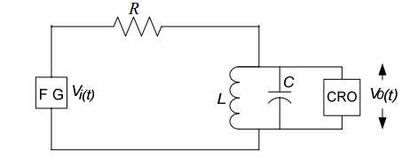

### Theory

In this experiment a circuit(Fig 1) will be provided. A p-p sinusoidal signal of amplitude 3V will be applied to it and its frequency response would be verifed to know which kind of filter circuit it is approaching to.
 

<figcaption style="position:relative;top:40px;left:50px;">[Fig 1:Passive Circuit diagram]</figcaption> 
  
After verifing frequency response a p-p square wave signal is applied to the circuit.Its frequency is adjusted to observe different harmonic components.Here we observe only 1st , 3rd & 5th harmonics by adjusting frequencies ,volt/division knob and time/division knob in oscilloscope.The peak amplitude of the
output votage may be in milivolts,depending on the passive components.In simulation the values of Fundamental component, 1st,3rd,5th harmonic coefficients are found at the end.We know that, a square wave is a combination of sine waves.generally,the equation of a square wave with amplitude 1V is : 
$$Y(t)= \frac{4}{π}[sin\omega t + \frac{sin⁡3\omega t}{3} + \frac{sin⁡5wt}{5} +……….]$$ 